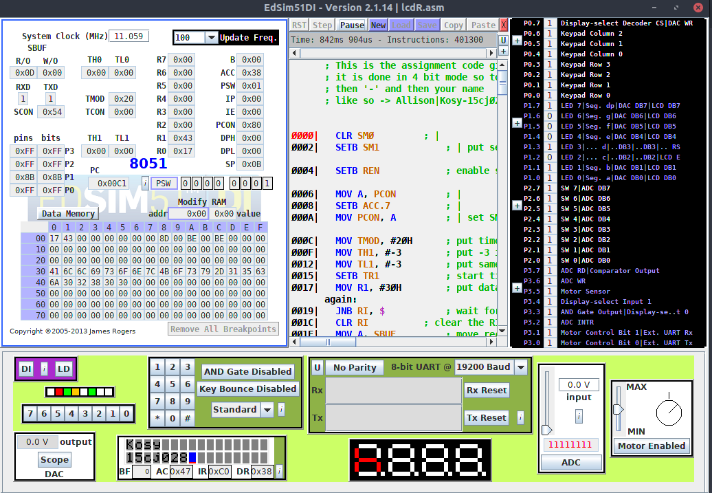

# CEN 511 Edsim assignment

Hi everyone, how is your december going, I hope its going better than
New york Knicks fans. Seriously imagine supporting a club thats so
hopelessly tied to mediocrity that you can literally feel hope
leaving you as you are watching, it's quite dreadful. Enough said
about basketball while a lot of us would rather have their holiday go like this


_Mr Okereke_ and the others imagined it going like this


There's an igbo proverb that says _O rie ka osi erie, ihe o koo koo_ which translated to english means
absolutely nothing useful, I don't even know why I brought it up. So in the spirit of
doing things for no reason I decided to share this to guys incase we are having any issues doing it
or if we have lost our sanity trying to figure out how to send #0EH to the LCD module 😡.

## Issues

If you want further explanation on the code you can 📨 message me and hopefully we can solve them
together or if you just want to dash me like 10k you can 📱call me or what the heck lets just skip
to the 💰 money **0069471301**

## Theory

> If you just want the code you can just scroll down

Your Edsim simulates the communication between the 8051 and the Hitachi HD44780U (LCD-II) Dot Matrix
Liquid Crystal Display Controller/Driver, what the hell is the HD44780U? I told you you could skip
that's your problem. Anyway the LCD module has 2 modes

| Mode       | Function                                                            |
| ---------- | ------------------------------------------------------------------- |
| 4 bit mode | You send data higher nibble first then clock edge then lower nibble |
| 8 bit mode | You send data in full bytes                                         |

And has the following input pins, ok this is too complicated to write, just read [here](http://www.circuitstoday.com/interfacing-16x2-lcd-with-8051), the edsim examples and the HD44780U [documentation](https://www.edsim51.com/8051simulator/HD44780.pdf)

## Disclaimer

While I vouch for the validity of this code let me state the following

- It may malfunction if your name is longer than 15 letters eg _Chinecherem_ or **Chinazamekperenkeoma** or
  [Srivaddhanaprabha](https://en.wikipedia.org/wiki/Vichai_Srivaddhanaprabha)
- If your matric is longer than 15 something is wrong with you
- This is guarnteed to work only under these settings



## Code

```asm


; This is the assignment code given to us
; it is done in 4 bit mode so to work it input your name followed by '|'
; then '-' and then your name, it uses a primitive loop to run
; like so -> Allison|Kosy-15cj02800


	CLR SM0			; |
	SETB SM1			; | put serial port in 8-bit UART mode

	SETB REN			; enable serial port receiver

	MOV A, PCON			; |
	SETB ACC.7			; |
	MOV PCON, A			; | set SMOD in PCON to double baud rate

	MOV TMOD, #20H		; put timer 1 in 8-bit auto-reload interval timing mode
	MOV TH1, #-3		; put -3 in timer 1 high byte (timer will overflow every 3 us)
	MOV TL1, #-3		; put same value in low byte so when timer is first started it will overflow after approx. 3 us
	SETB TR1			; start timer 1
	MOV R1, #30H		; put data start address in R1
again:
	JNB RI, $			; wait for byte to be received
	CLR RI			; clear the RI flag
	MOV A, SBUF			; move received byte to A
	CJNE A, #0DH, skip	; compare it with 0DH - it it's not, skip next instruction
	JMP finish			; if it is the terminating character, jump to the end of the program
skip:
	MOV @R1, A			; move from A to location pointed to by R1
	INC R1			; increment R1 to point at next location where data will be stored
	JMP again			; jump back to waiting for next byte
finish:
CLR TR1

MOV TMOD, #20H
MOV TH1, #00h
MOV TL1, #00h


; initialise the display
; see instruction set for details


	CLR P1.3		; clear RS - indicates that instructions are being sent to the module

; function set
	CLR P1.7		; |
	CLR P1.6		; |
	SETB P1.5		; |
	CLR P1.4		; | high nibble set

	SETB P1.2		; |
	CLR P1.2		; | negative edge on E

	CALL delay		; wait for BF to clear
					; function set sent for first time - tells module to go into 4-bit mode
; Why is function set high nibble sent twice? See 4-bit operation on pages 39 and 42 of HD44780.pdf.

	SETB P1.2		; |
	CLR P1.2		; | negative edge on E
					; same function set high nibble sent a second time

	SETB P1.7		; low nibble set (only P1.7 needed to be changed)

	SETB P1.2		; |
	CLR P1.2		; | negative edge on E
				; function set low nibble sent
	CALL delay		; wait for BF to clear


; entry mode set
; set to increment with no shift
	CLR P1.7		; |
	CLR P1.6		; |
	CLR P1.5		; |
	CLR P1.4		; | high nibble set

	SETB P1.2		; |
	CLR P1.2		; | negative edge on E

	SETB P1.6		; |
	SETB P1.5		; |low nibble set

	SETB P1.2		; |
	CLR P1.2		; | negative edge on E

	CALL delay		; wait for BF to clear


; display on/o0ff control
; the display is turned on, the cursor is turned on and blinking is turned on
  MOV A, #0Fh
  CALL sendCharacter


; send data
rs:
	SETB P1.3		; clear RS - indicates that data is being sent to module
	MOV R1, #30H	; data to be sent to LCD is stored in 8051 RAM, starting at location 30H

loop:
	MOV A, @R1		; move data pointed to by R1 to A

    CJNE A, #'-', oda ; check for sep character for new line
	JMP nl ; go to nl subroutine if Accumulator = '-'


nl:
; call wait subroutine to see data
CALL wait

  ; Set lcd module to recieve command RS->0
   CLR P1.3

; send new line command
 MOV A, #0C0H
 CALL sendCharacter

; set lcd module to recieve data

SETB P1.3
INC R1
JMP loop


oda:

    CJNE A, #'|', cont ;check for sep character |
	CALL clear; clear lcd if Accumulator = |
	INC R1 ; point to next memory location
	JMP loop ; continue exec
cont:
	JZ end			; if A is 0, then end of data has been reached - jump out of loop
	CALL sendCharacter	; send data in A to LCD module
	INC R1			; point to next piece of data
	JMP loop		; repeat

end:
	CALL clear
	JMP rs

; subroutine to send data to lcd
sendCharacter:
	MOV C, ACC.7		; |
	MOV P1.7, C			; |
	MOV C, ACC.6		; |
	MOV P1.6, C			; |
	MOV C, ACC.5		; |
	MOV P1.5, C			; |
	MOV C, ACC.4		; |
	MOV P1.4, C			; | high nibble set

	SETB P1.2			; |
	CLR P1.2			; | negative edge on E

	MOV C, ACC.3		; |
	MOV P1.7, C			; |
	MOV C, ACC.2		; |
	MOV P1.6, C			; |
	MOV C, ACC.1		; |
	MOV P1.5, C			; |
	MOV C, ACC.0		; |
	MOV P1.4, C			; | low nibble set

	SETB P1.2			; |
	CLR P1.2			; | negative edge on E

	CALL delay			; wait for BF to clear

  RET


; waits for lcd buffer to clear -> 37us
delay:
	MOV R0, #50
	DJNZ R0, $
	RET

; sub routine to clear
clear:

; Set lcd module to recieve command RS->0
   CLR P1.3

   CALL wait

   ; command to move cursor to top left

   MOV A, #80H
   call sendCharacter

; command to clear lcd

    MOV A,#01H
	CALL sendCharacter


; wait for buffer to clear. necessary to wait like 1500ms or so
	MOV R0, #0FFh
	DJNZ R0, $
	MOV R0, #0FFh
	DJNZ R0, $
	MOV R0, #0FFh
	DJNZ R0, $
MOV R0, #0FFh
	DJNZ R0, $


    SETB P1.3

	RET

;Wait to see result.
;  set to wait 6 machine cycles
; about 3 secs depending on refresh rate
wait:
MOV TH1, #00h
MOV TH1, #00h


 SETB TR1

 ;cycle 1
 JNB TF1, $
 CLR TF1


 ;cycle 2
JNB TF1, $
CLR TF1

;cycle 3
JNB TF1, $
CLR TF1

;cycle 4
 JNB TF1, $
 CLR TF1

 ;cycle 5
JNB TF1, $
CLR TF1

;cycle 6

JNB TF1, $
CLR TF1

; stop timer
CLR TR1
MOV TH1, #00h
MOV TL1, #00h
RET

```

## Final notes

I hope this document finds you in good terms and I beseech you to have a
wonderful christmas. Beseech what does it even mean and why was Apostle Paul
always beseeching people


## Credits

All illustrations from [Undraw](https://undraw.co) and is used under the [license](https://undraw.co/license)
Edsim is a registered product for [Edsim](https://www.edsim51.com/) pictures
of the Edsim software are only included for illustration purposes and is in no way affiliated with Allison Kosy.
Brand names and or logos used are registered trademarks of their respected owners. Are included on educational
basis and do not represent any association with Allison Kosy
